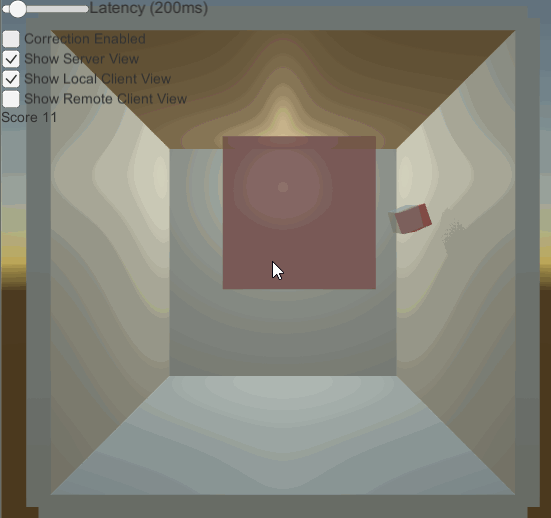
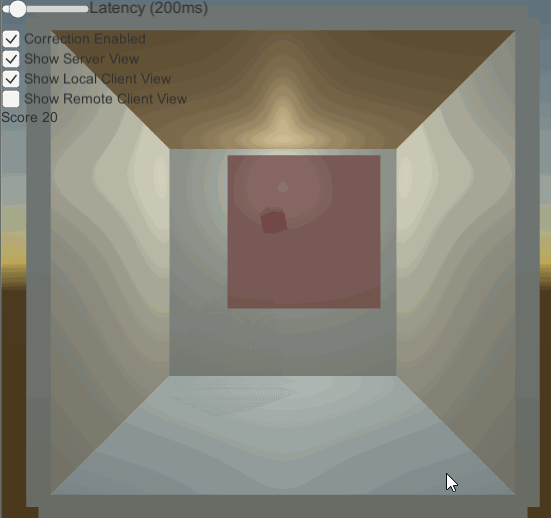
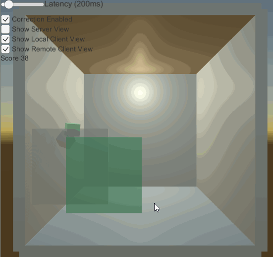
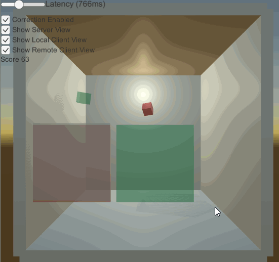

# Network physics test bed

This project simulates the interaction between a client and server on a single Unity instance.

User can control a paddle using WASD, and try to reflect back a cube. The server detemines if the cube has gone past the paddle, and increments the score. The cube is relaunched after a score, or by pressing Space.

## Local client side prediction

Server is authoritative of all rigidbodies. Client side prediction is used to smooth gameplay experience for client.

Client sends input to the server, and both the server and client simulate physics. When the client receives a snapshot update from the server, it determines if the client state (at the server snapshot's timestamp) is sufficiently different to the server snapshot state. If so, it resets the client rigidbodies to the server snapshot state, and re-simulates the physics from the server snapshot's timestamp.

Without correction, the local client cube (grey) diverges from the server cube (red).

With correction, the grey cubes stay in sync.

## Remote client view

A remote client who is not controlling input cannot predict the state of the paddle. In their scene, the rigidbodies interpolate towards the last received server input. They effectively see the game state in the past.

Without prediction, the remote paddle and cube (green) are a delayed version of the local client state.

At high latency, this delay is even more apparent

In a game where a ball moves between a local paddle and remote player's paddle (on the other side of an arena), the remote player's paddle will be displayed in past state. However, the predicted ball position will be the present state. This will lead to situations where the ball will be returned, despite the remote paddle appearing to have not reached the ball.

To accomodate this, the displayed ball can interpolate between an predicted state when it is on the local side of the area, and an unpredicted state at the remote side of the arena.

The pink cube can be seen to interpolate between the local client cube (grey) and the remote client cube (green) as it moves between each side of the arena. 

# Future work
- Simulate latency for client messages
- Variable snapshot rate for server messages
- Simulate packet loss
	- Accomodate for this by re-sending redundant inputs to server
- Simulate out of order packets
- Compress packet size
- Correction smoothing
- Send packets across network rather than simulation

# References
- http://www.codersblock.org/blog/client-side-prediction-in-unity-2018
- http://www.gabrielgambetta.com/client-server-game-architecture.html
- https://gafferongames.com/post/networked_physics_2004/